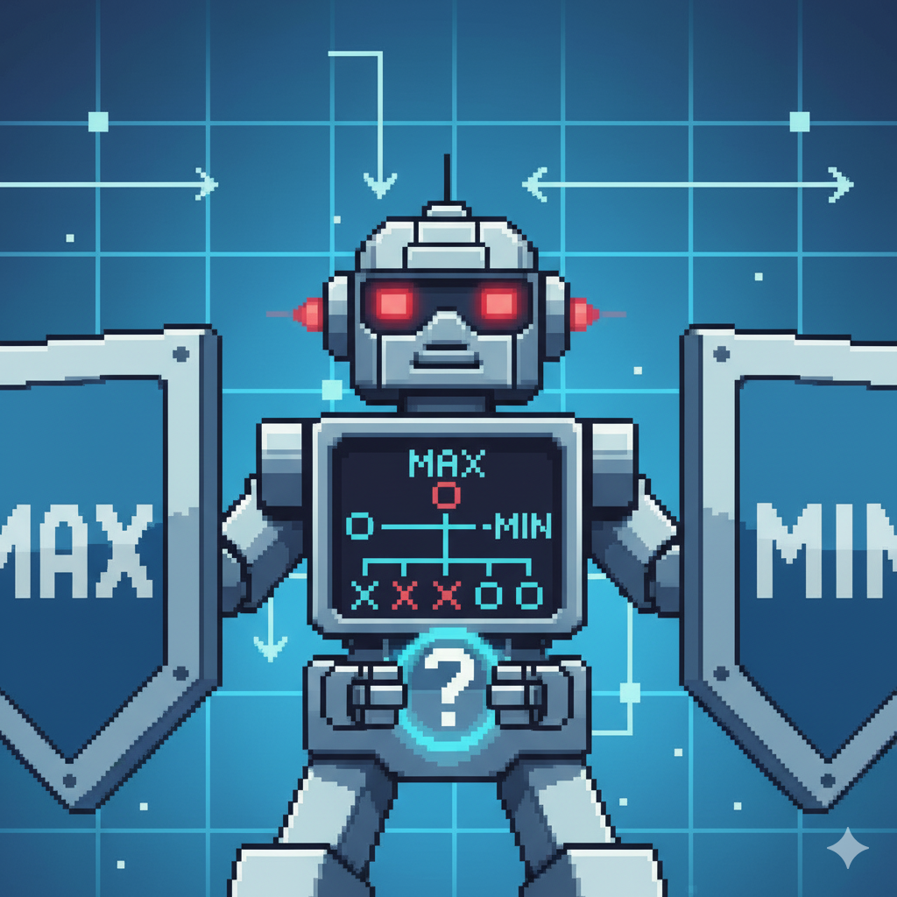
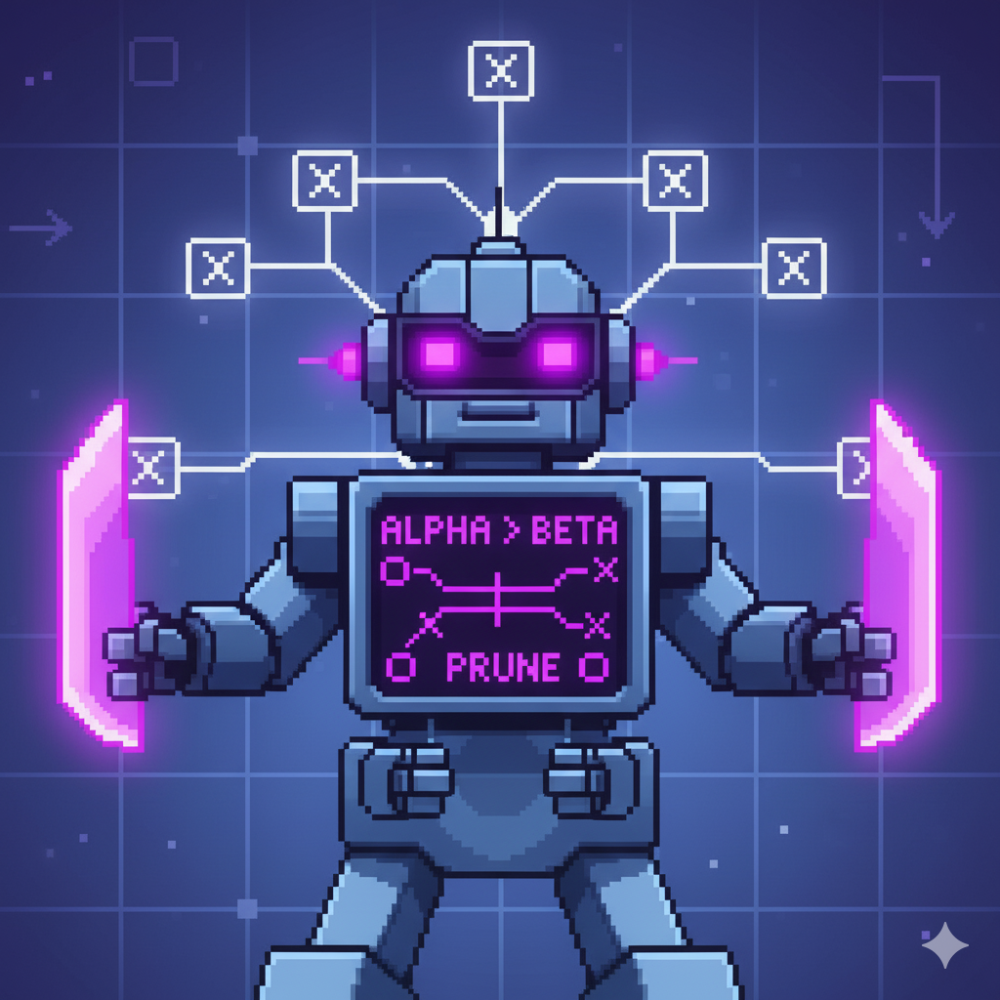

# Project 2 (Breakthrough game agents)

In this project we had to create a computer agent that will play the 2 player board game called [Breakthrough](<https://en.wikipedia.org/wiki/Breakthrough_(board_game)>).

### Running the program

All assests and necessary codes are within the project folder. We can just run the command below and choose the selected gameplay option.

```bash
python game.py
```

**For settings**

Go to settings page by clicking the **setting icon** in the main menu page then change either the _board size_ or _rule_.

### Icons

These are some of the icons and assets used in the game that have some meanings.

| **Asset**                                                | **Meaning**           |
| -------------------------------------------------------- | --------------------- |
|                      | Player (Human)        |
|        | Minimax algorithm     |
|  | Alpha-Beta algorithm  |
|              | Offensive heuristic 1 |
|             | Defensive heuristic 1 |
|         | Offensive heuristic 2 |
|        | Defensive heuristic 2 |
|                      | Reset button          |
|                     | Game complete         |
|                   | Settings icon         |

### References

Following are the list of references accessed by us to complete the project.

- [Baral Tech](https://github.com/baraltech/Menu-System-PyGame) - For Scene system
- [Kenney Assets](https://kenney.nl/assets/category:2D) - For assets
- [Gemini](https://gemini.google.com/app) - For code improvements
- [Gemini Nano Banana](https://gemini.google/overview/image-generation/) - For custom images (minimax, alpha-beta images)
- [Breakthrough](<https://en.wikipedia.org/wiki/Breakthrough_(board_game)>) - For game rules and gameplay
